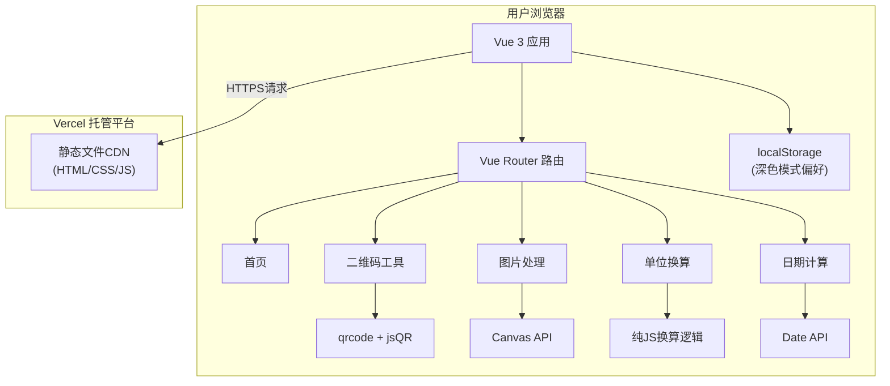

# 实用工具箱 - 技术架构文档

## 1. 架构设计

本项目为纯前端单页应用（SPA），无后端服务和数据库。所有工具逻辑在浏览器端通过JavaScript执行，用户数据仅存储在本地localStorage。部署于Vercel静态托管平台。



## 2. 技术说明

| 类别 | 技术选型 | 版本 | 用途 |
|------|---------|------|------|
| 构建工具 | Vite | latest | 快速开发构建 |
| 框架 | Vue 3 (Composition API + script setup) | 3.x | 前端框架 |
| 语言 | TypeScript | 5.x | 类型安全 |
| 路由 | Vue Router | 4.x | SPA路由 |
| 样式 | Tailwind CSS | 3.x | 原子化CSS，打造精致UI |
| 图标 | lucide-vue-next | latest | 矢量图标库 |
| 二维码生成 | qrcode | latest | 生成二维码图片 |
| 二维码解析 | jsqr | latest | 从图片解析二维码 |
| 部署平台 | Vercel | - | 免费静态托管、自动HTTPS、CDN |

**不使用后端服务**，所有运算在浏览器端完成。不使用Element Plus，改用Tailwind CSS自定义设计更精致独特的界面风格。

## 3. 路由定义

| 路由路径 | 页面组件 | 用途 |
|---------|---------|------|
| `/` | Home.vue | 首页，工具列表与搜索 |
| `/tools/qrcode` | QrCode.vue | 二维码生成与解析工具 |
| `/tools/image-process` | ImageProcess.vue | 图片压缩/格式转换/尺寸调整 |
| `/tools/unit-converter` | UnitConverter.vue | 多分类单位换算 |
| `/tools/date-calc` | DateCalc.vue | 日期差计算与日期推算 |

## 4. 项目结构

```
├── src/
│   ├── assets/              # 静态资源
│   ├── components/          # 公共组件
│   │   ├── NavBar.vue       # 顶部导航栏
│   │   ├── Footer.vue       # 页脚
│   │   ├── ToolCard.vue     # 工具卡片
│   │   └── ThemeToggle.vue  # 深色模式切换
│   ├── composables/         # 可复用组合式函数
│   │   └── useTheme.ts      # 深色/浅色主题管理
│   ├── pages/               # 页面组件
│   │   ├── Home.vue
│   │   └── tools/
│   │       ├── QrCode.vue
│   │       ├── ImageProcess.vue
│   │       ├── UnitConverter.vue
│   │       └── DateCalc.vue
│   ├── router/
│   │   └── index.ts         # 路由配置
│   ├── utils/               # 工具函数
│   │   ├── units/           # 单位换算数据与逻辑
│   │   └── image.ts         # 图片处理工具函数
│   ├── App.vue              # 根组件
│   ├── main.ts              # 应用入口
│   └── style.css            # 全局样式与Tailwind
├── public/                  # 公共静态资源
├── index.html
├── package.json
├── vite.config.ts
├── tsconfig.json
├── tailwind.config.js
└── postcss.config.js
```

## 5. 数据模型

本项目无数据库，无后端API。数据存储策略：

- **localStorage**：
  - `theme`: `'light' | 'dark'`，用户主题偏好
- **浏览器内存**：工具运算过程中的临时数据，页面关闭即清除
- **不收集任何用户数据**，不使用Cookie，不做追踪

## 6. 部署方案

1. GitHub仓库托管源代码
2. Vercel关联GitHub仓库
3. 每次push到main分支自动触发构建部署
4. 分配 `xxx.vercel.app` 免费域名，自带HTTPS
5. 可选：绑定自定义域名
6. 构建命令：`npm run build`，输出目录：`dist/`
